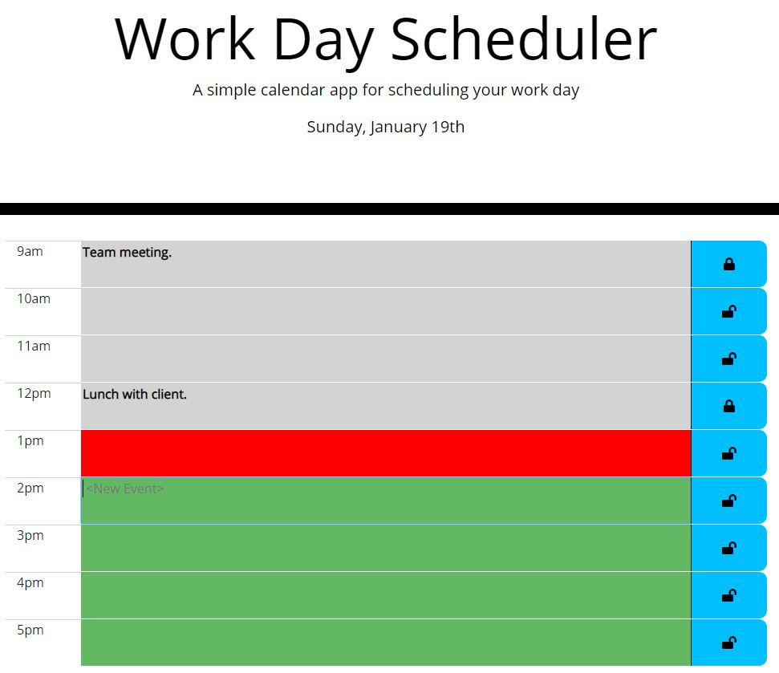

# workDayScheduler

The purpose of this site is to manage a workday schedule.

## Getting Started / Prerequisites

The user clicks on a row to select the hour and enter a task. Clicking the lock icon allows the user to save or edit the task. 

### Installing

No installation required.

## Authors

Matthew Grove

## License

N/A
